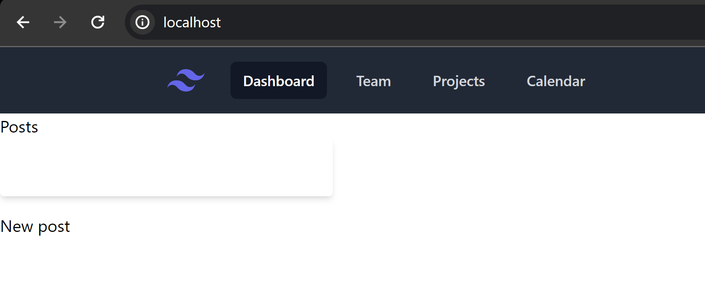
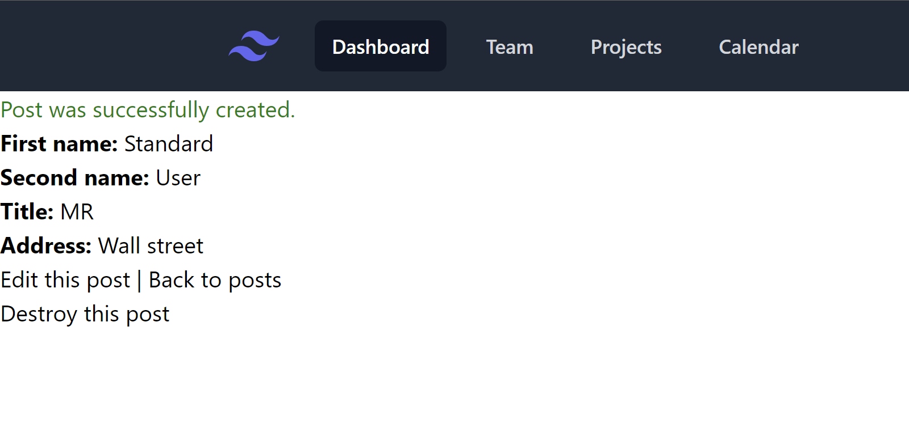
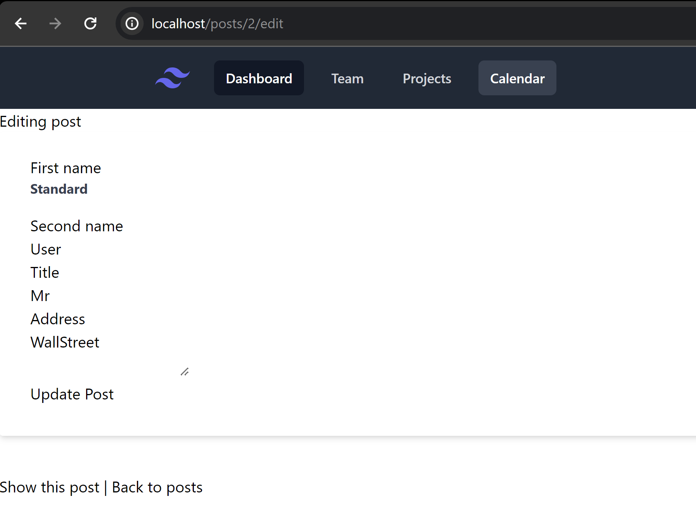
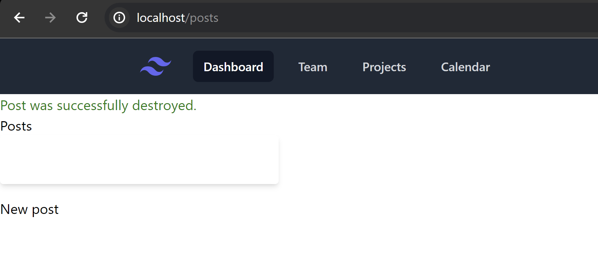
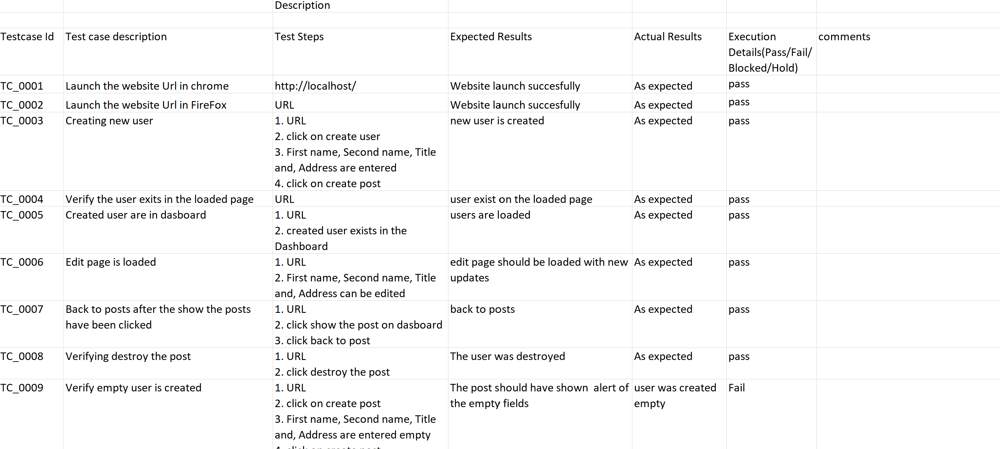

# Testing user management project with Robot framework

<!-- ABOUT THE PROJECT -->
## About The Project
User management application running in Docker. The application could be hosted locally or on any cloud. If hosted locally, the application is available in the URL - 
http://localhost/

<!-- GETTING STARTED -->
## Getting Started
Before starting the testing with ROBOT, the Docker should be running. The Docker image should be executed and the application is available for data entry. Following steps could be used to create records in the portal.

* User list page - Lists created users with the webpage. In the portal, users are called as posts.

  

* New user -  FirstName, SecondName, Title and Address are created 

   

* Editing user - Editing FirstName, SecondName, Title and Address

   

* Deleting user - Deleting the user containing FirstName, SecondName, Title and Address

   

### Dependencies
* Windows or Linux OS
* VS code editor
* Python installed within virtual env
* Robot Framework
* Selenium Library
* Docker

### Usage

1. Open the project in VS Code or your preferred IDE.
2. Navigate to the `Resources/TestSuite/robot` directory.
3. Locate the test files with the `.robot` extension.
4. Run the test files using VS Code to execute the automated test scenarios.

### Manual testing of the same user management project

Using Excel, user inputs, creating, editing, and deleting the user have been tested.
   